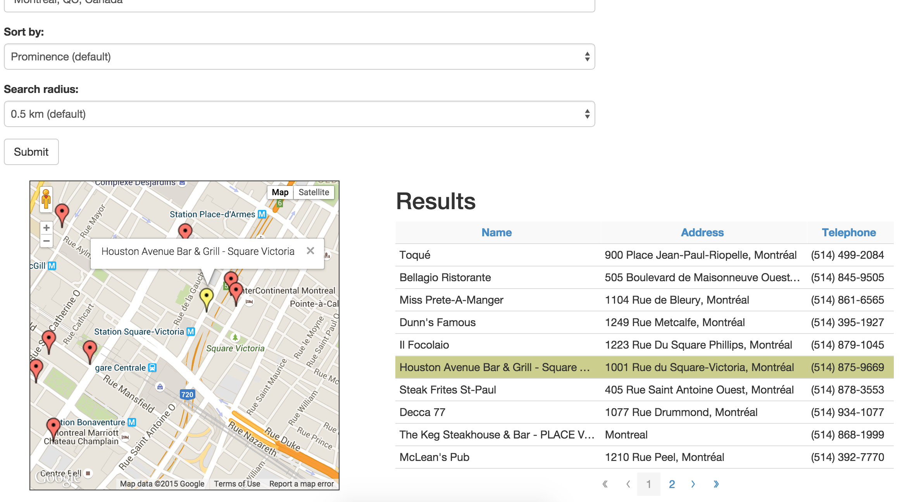

# Find the nearest restaurants

# Basic features
Feature 1: 
The user can input a location through autocompletion of google maps. 

Feature 2:
Based on selections on how to sort the list (by prominence or by distance), all the results will be added to a Backbone collection of places. 
The pagination is implemented based on the views from https://github.com/backbone-paginator/backbone.paginator. 
Each page displays 10 results. 

Feature 3:
Sorting by distance is supported.

Feature 4: 
UI is easily implemented based on bootstrap. 

# Additional features
Markers are shown for the current page. 

A list of all restaurant can be obtained if the user selects the option of "search by prominence". 

The marker will be displayed in yellow when the corresponding restaurant is click from the current page. 

Responsiveness is provided by bootstrap grid system.

Pagination is supported. 

The screenshot is shown below:

